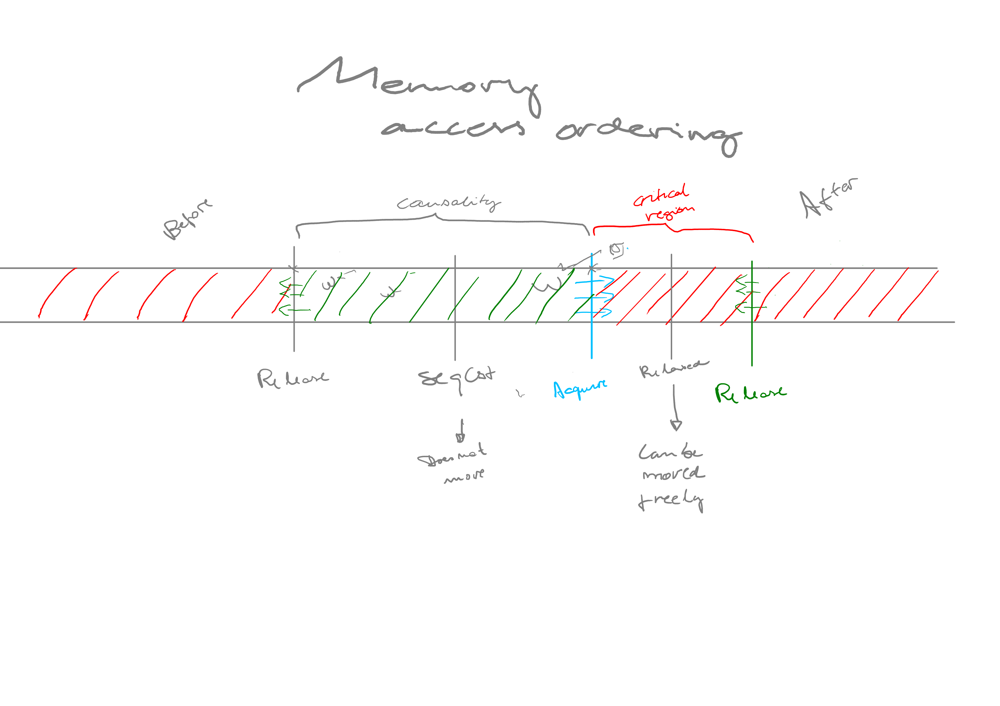

# Rust 

## Borrow checker

* Each value in Rust has an owner.
* There can only be one owner at a time.
* A variable is valid if it is in scope.
* When the owner goes out of scope, the value will
  be dropped. Implemented by the `Drop` trait and
  the `drop` function.
* Variables become invalid after dropped.
* **Move semantics** means passing the ownership of a
  value (to a function for example). 
  * Moved values are shallow copies, see `Copy`
    trait, scallars types (`i32`, `i64`, ..., `bool`),
    or types with known compile-time size.
  * Values that live in the stack implements the
    `Copy` trait. 
  * When a value is moved the variable becomes invalid.
* **Borrow semantics** means getting a reference to a
  value.
  * Ampersands, `&` represent references, and they
    allow you to refer to some value without taking
    ownership of it.
    * The oposite of `&` is `*`, the deferencing
      operator.
    * References must always be valid whem they
      are used.
    * At any given time, you can have either one
      mutable reference or any number of immutable
      references.
* `let s = "Hello, world!";` The type of s here is
  &str: it’s a slice pointing to that specific point
  of the binary. This is also why string literals
  are immutable; &str is an immutable reference.
* `let s' = {..s}` assignment of structs copy Copy data,
  and move heap data from `s` into `s'` and marks `s`
  as invalid.

## Paths

* Rust structs are instantiated in the stack and
  copied to the heap. There are ways to instantiate
  the data directly on the heap, but it is unsafe.
  `crate::` is like `/` in paths, the root of our
  crate’s module tree. `super` at the start of the
  path. This is like starting a filesystem path with
  the .. syntax. 

## The `?` operator

* The `?` placed after a `Result` value is defined to
  work in almost the same way as the match
  expressions where the value of the Result is an
  Ok, the value inside the Ok will get returned from
  this expression, and the program will continue. If
  the value is an Err, the Err will be returned from
  the whole function as if we had used the
  `return` keyword so the error value gets
  propagated to the calling code.
* `?` will call `From::from` errors to make
  them compatible to the caller error type.
  * `?` works for `Result` and `Option` out of
    box. And `Try` implementations.
* A type’s behavior consists of the methods we can
  call on that type. 
* Types are *sized* by default. *Sized* types are
  types with known compile time size. Ex:  `u32` is
  sized, while `[u32]`  is not.
  * This restriction can be relaxed by using the
    `T: ?Sized` syntax.

## Traits
* Within an impl block, the type Self is an alias
  for the type that the impl block is for
* Methods are implemented by takig the `self` as
  first parameters inside an `impl` block for a
  struct or trait.
* Associated functions dont have a `self` first
  parameter (inside an `impl` block for a
  struct or trait).
* Rust makes borrowing implicit for method receivers.
  * When you call a method with
    `object.something()`, Rust automatically adds in
    `&`, `&mut`, or `*` so object matches the
    signature of the method. This automatic
    referencing behavior works because methods have
    a clear receiver—the type of self.
* Trait Bound Syntax:
  `fn foo(x: &impl Foo)` is sugar for `fn foo<T: Foo>(x: &T)`
* Multiple trait bounds: These are equivalents
  `(item: &(impl Foo + Bar))`
  `<T: Foo + Bar>(item: &T)`
* Where syntax move trait bounds to the end of the
  function signature. So these are equivalents:
  `fn f<T: A>(x: &T) -> i32 {`
  `fn f<T>(x: &T) -> i32 where T: A` 
* Use `impl <T: Foo> Bar<T> {` to conditionally
  implement `Bar`, depending on `T` implementing
  `Foo`.
* Associated types connect a type placeholder with
  a trait such that the trait method definitions can
  use these placeholder types in their signatures.

## Atomics

* Memory orders:
  * Sequentially Consistent (SeqCst)
  * Release
    * When thread A releases a location in memory and then thread B
      subsequently acquires the same location in memory, causality is
      established. 
  * Acquire
    * Intuitively, an acquire access ensures that every access after it stays
      after it.
    * operations that occur before an acquire are free to be reordered to occur
      after it.
    * Basic use of release-acquire is therefore simple: you acquire a location
      of memory to begin the critical section, and then release that location
      to end it. For instance, a simple spinlock might look like:
  * Relaxed
    * Can be reordered freely

